# Reduced-Basis Neural Surrogates for the Heat Equation with a Nonlinear Radiation Boundary Condition

*A Gridap × SciML prototype for orbital compute thermal design.*

## Abstract

We extend the reduced-basis neural-surrogate recipe of the parent project (learn POD
coefficients $\mu \mapsto c$, never the full field) to a genuinely nonlinear problem: the
heat equation on a 2D radiator section whose dominant heat rejection is Stefan–Boltzmann
radiation to deep space ($T_\text{space} = 3\,$K), with parametric emissivity and electronics
load cycles. Two results stand out. **(i)** For a *fixed* load geometry the steady solution
manifold is numerically **rank-3** ($\sigma_3/\sigma_1 \approx 7\cdot 10^{-9}$): the parameters
move temperature levels and amplitudes of essentially fixed spatial shapes, so all of the
problem's strong nonlinearity lives in the coefficient map $c(\mu)$. This is exactly the
regime where a tiny coefficient mapper is the right surrogate, and where the reconstruction
basis is *provably* not the bottleneck. **(ii)** Transient load switching restores a genuinely
higher-dimensional manifold: the space-time POD spectrum decays orders of magnitude more
slowly, and the resulting $(\mu, t) \mapsto c$ surrogate reproduces full-order **design
rankings** (worst-case chip temperature over a load cycle, across an emissivity × duty grid)
with Spearman correlation 0.999 at hundreds of times the throughput. This is a controlled 2D
prototype, not a general theorem.

## 1. Introduction

The parent project established, for a linear parametric elliptic PDE, that learning $r$
reduced-basis coefficients beats learning full fields. The obvious objection is that real
thermal problems are not linear: space thermal management in particular is dominated by the
$T^4$ Stefan–Boltzmann law. This sub-project makes the nonlinearity the central object. It is
in the boundary condition, it is strong (temperatures span hundreds of kelvin across the
parameter box), and it is exactly the kind of term that breaks *intrusive* reduced-order
methods, which need hyper-reduction (DEIM/EIM) to evaluate $u^4$ online. The non-intrusive
coefficient-mapper approach is agnostic to how nonlinear the full-order model is, a point
this prototype demonstrates concretely.

**Relevance to high-power space systems.** High-power electronics and compute systems in
space must reject waste heat exclusively through thermal radiation, as convection is
unavailable in vacuum. This creates strong nonlinearity in the boundary heat flux due to the
Stefan–Boltzmann law. Efficient parametric modeling of such systems is required for design
studies involving varying material properties, emissivity, power profiles, and orbital
thermal environments. The present work develops a reduced-basis neural surrogate for the
time-dependent heat equation with a nonlinear radiative boundary condition as a controlled
prototype targeting this class of problems. The surrogate learns only the coefficients of a
data-derived basis while preserving the dominant radiative physics through an explicit
residual that includes the $T^4$ term.

The concrete motivation is AI1-class orbital compute (SpaceX reveal, June 2026; see
`docs/images/`): 150 kW-peak compute rejected through ~110 m² of deployable radiators, about
1.4 kW/m², which our parameter regime brackets. The reveal's spec numbers are used as
*motivation only*, not as model inputs.

## 2. Mathematical background

Strong form on $\Omega = (0,1) \times (0,0.5)$ m:

$$\rho c\, \partial_t u = \nabla\!\cdot\!(k \nabla u) + q(x;\mu,t), \qquad
-k\,\partial_n u = \varepsilon(\mu)\,\sigma\,(u^4 - T_\text{space}^4) \ \text{on } \Gamma_r,$$

with the remaining edges insulated (canonical config B) and the steady problem obtained by
dropping the time term. In code the radiation nonlinearity is written $u|u|^3 - T_s^4$: it
coincides with $u^4 - T_s^4$ for $u > 0$ and is monotone on all of $\mathbb{R}$, so Newton
iterates that momentarily dip negative still feel a restoring flux of the correct sign.

Two structural facts drive the validation suite. First, with no Dirichlet DOFs the constant
$v \equiv 1$ lies in the test space, so the solved discrete system satisfies the **exact
discrete energy balance** $P_\text{in} = \oint \varepsilon\sigma (u_h^4 - T_s^4)\,d\Gamma$ up
to the Newton tolerance. Second, the boundary Jacobian is analytic,
$4\varepsilon\sigma|u|^3$ on $\Gamma_r$, giving a hand-written matrix to check the assembled
AD Jacobian against. The dimensionless **radiation number** $\mathrm{Nr} = \varepsilon\sigma
T^3 L / k$ measures how strongly radiation couples relative to conduction; over our parameter
box it spans roughly 0.05–1.5.

POD/SVD compression is inherited verbatim from the parent project (plain $\ell^2$ inner
product on the uniform grid; Eckart–Young optimality; mass-weighted POD remains future work).
One honest difference: the parent's "reconstructions satisfy the BCs exactly by construction"
selling point does **not** carry over, since the radiation BC is part of the residual. QoI
fidelity (radiated power, peak temperature) takes over that role.

## 3. Numerical solver: Gridap assembles, SciML solves

The FE machinery is [Gridap.jl](https://github.com/gridap/Gridap.jl): a
`CartesianDiscreteModel` (default 60×30, P1 Lagrangian; element order is a config knob), the
weak residual

$$R(u; v) = \int_\Omega k \nabla v \cdot \nabla u \; - \int_\Omega v\, q
\; + \oint_{\Gamma_r} v\, \varepsilon\sigma\,(u|u|^3 - T_s^4),$$

boundary quadrature of degree 6 (the $v\,u^4$ integrand is degree 5 for P1), and Gridap's
autodiff for the Jacobian. Everything downstream of assembly is the SciML stack:

- **Steady:** the algebraic operator is wrapped as a `NonlinearFunction` (in-place residual
  and Jacobian, sparse `jac_prototype`) and solved by `NonlinearSolve.NewtonRaphson`,
  warm-started along parameter sweeps and initialised at the analytic radiative-equilibrium
  temperature $(Q/(\varepsilon\sigma|\Gamma_r|) + T_s^4)^{1/4}$. Every residual evaluation is
  logged, so Newton traces are first-class artifacts.
- **Transient:** method of lines, $M \dot u = -R_\text{space}(u) + Q(t) F_\text{unit}$, with
  the consistent $\int \rho c\, u v$ mass matrix, integrated by OrdinaryDiffEq mass-matrix
  methods: `ImplicitEuler` and `Trapezoid` (the θ-family the scope document asked for), plus
  adaptive `FBDF` for production runs. Square-wave load switches are passed as `tstops`, so
  discontinuities are hit exactly rather than smeared.

This division of labour is the point of the architecture. "Residuals and Jacobians under
control" means we hand the *assembled* $R$ and $J$ to the solver ourselves, and can therefore
test them (below) independently of any solver behaviour.

## 4. Solver validation

Seven named test files (49 assertions) pin the physics before any ML enters:

| Test | What it pins | Result |
| --- | --- | --- |
| `test_steady_solver` | tags/geometry, ε=0 linear limit vs direct sparse solve, NewtonRaphson vs TrustRegion, warm starts | pass (agreement ≤ 1e-9) |
| `test_jacobian` | AD Jacobian vs central FD in random directions; vs hand-written $A_\text{cond} + 4\varepsilon\sigma|u|^3$ boundary block | pass (≤ 1e-6 / 1e-9 rel) |
| `test_energy_balance` | exact discrete balance (config B); reaction-recovered wall influx (config A) | rel ≤ 1e-8 (measured ~1e-10) |
| `test_manufactured_solution` | MMS **through the nonlinear BC** (inhomogeneous radiation data), P1 L² order 2, band [1.7, 2.2] | rates **1.9996, 1.9999, 2.0000** |
| `test_analytic_equilibrium` | closed-form 1D profile $u_1 = (q_0 L/\varepsilon\sigma + T_s^4)^{1/4}$ | nodally exact (2.6e-12 K) |
| `test_transient` | steady long-time limit; fixed-Δt orders vs tight FBDF reference; energy bookkeeping $\Delta E = \int (P_\text{in} - P_\text{rad})$ | BE rates 0.95–0.98, CN 2.08–2.00; bookkeeping < 1% |
| `test_pod_models` | POD orthonormality/round-trip, mapper shapes, determinism, trainability | pass |

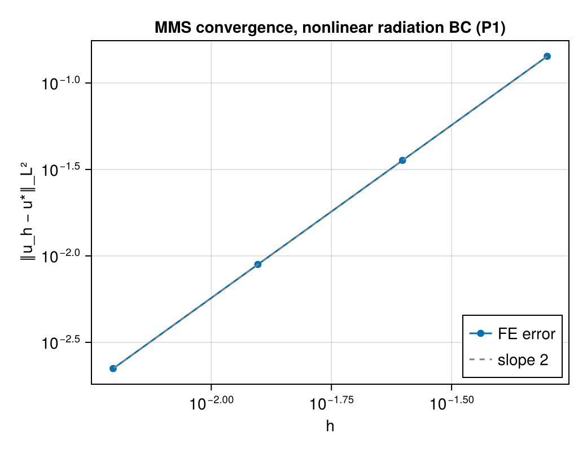
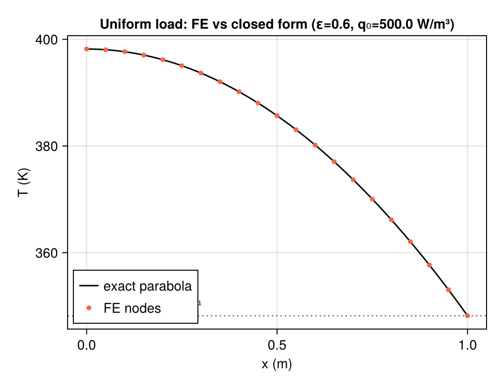

Two details are worth recording. The 1D uniform-load test is *nodally exact* (P1 nodal
superconvergence via the piecewise-linear Green's function), a far stronger check than the
intended $O(h^2)$ tolerance. And all energy bookkeeping must use the *discretely injected*
power $Q \cdot \int \hat q\, d\Omega_h$: on grids where the chip patch does not align with
cell faces the quadrature captures only part of the nominal $Q$, and the discrete system
conserves the quadratured value, not the nominal one.

## 5. Steady dataset and the rank-3 surprise

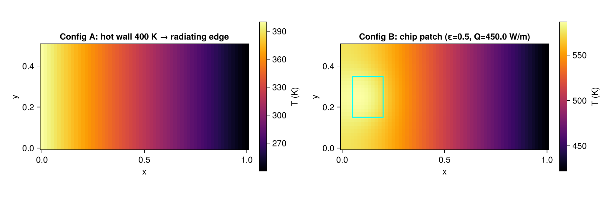

512 Sobol samples over $\mu = (\varepsilon, Q) \in [0.1, 0.95] \times [100, 800]$ W/m, one
converged Newton solve each (median 49 ms, worst energy balance 6e-12, peak temperatures
296–973 K). The POD of the 410 training snapshots delivers the project's first headline:

| $r$ | $\sigma_r/\sigma_1$ | reconstruction error (test) |
| ---: | ---: | ---: |
| 1 | 1 | 1.1e-1 |
| 2 | 1.15e-1 | **1.1e-9** |
| 3 | 7.2e-9 | 6.2e-16 |
| 5 | 6.1e-16 | 1.8e-16 |

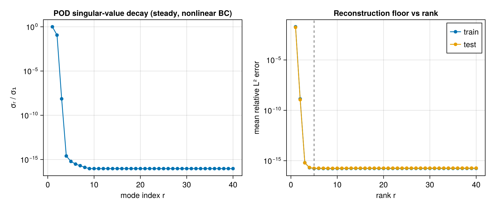

**The steady manifold is numerically rank three** (and rank *two* for every practical
purpose). Mechanism: with the load geometry fixed, varying $Q$ scales the (linear)
source-response shape exactly, and varying $\varepsilon$ mostly moves the radiative
equilibrium *level*, a strongly nonlinear scalar multiplying the constant mode. Strong
parameter nonlinearity is invisible to POD rank: it lives entirely in the coefficient map
$c(\mu)$, which is precisely what the neural mapper is for. This also previews §8.4: what
re-thickens the manifold is not the parameters but the *transients*.

Practical consequence for training: the coefficient dynamic range is $c_1 : c_3 \approx
10^9$, so a raw MSE loss cannot learn the small modes (their gradients are ~$10^{-18}$).
All mappers are therefore trained on **whitened coefficients** $\tilde c_i = c_i /
\mathrm{std}(c_i)$, with the scales stored in the model file and re-applied at prediction
time.

## 6. Surrogate models

The learned operator is the same factorization as the parent project,
$\hat G = R \circ N$: a fixed linear reconstruction $R(c) = \bar u + \Phi_r c$ and a small
learned map $N: \tilde\mu \mapsto c$ (inputs standardized to $[-1,1]^d$). Three mappers are
compared: a POD-MLP (tanh, 64×3), a POD-KAN (`KolmogorovArnold.KDense`, kept as a *compact
coefficient-mapper baseline*, not a structural ingredient), and a direct MLP $\mu \mapsto u$
baseline trained on scaled fields.

The contrast that motivates non-intrusive reduction here: an intrusive POD-Galerkin ROM of
this problem would need a Newton solve *in the reduced space* at every query, with the $u^4$
boundary term evaluated by hyper-reduction (DEIM/EIM) to stay independent of $n$. The
coefficient mapper sidesteps both, because the FOM's nonlinearity is baked into the training
data. The price is being purely data-fit inside the sampled box, with the assembled nonlinear
residual retained as an *a posteriori* physics check.

## 7. Evaluation metrics

Per test sample: relative L² field error; coefficient error; the **nonlinear PDE residual**
$\|R(\hat u)\|_2 / \|F_\text{load}\|_2$ evaluated with the same Gridap assembly as the solver
(the honest generalization of the parent's $\|A\hat u - b\|/\|b\|$); and two design QoIs,
relative radiated-power error and absolute peak-temperature error (K). *Timing caveat:*
surrogate speed-ups are reported as both single-query latency and batched throughput,
including reconstruction, excluding plotting and model loading, after warm-up; the FOM
reference is the full Newton solve described in §3.

## 8. Results

### 8.1 Steady accuracy and the rank sweep

Held-out evaluation (102 samples), deployed rank **r = 2** (pinned by the sweep below;
seeds are rank-keyed so the deployed models *are* the sweep models):

| model | rel L² | rel residual | coef err | ΔP/P | ΔT_peak (K) | params |
| --- | ---: | ---: | ---: | ---: | ---: | ---: |
| direct MLP | 5.80e-3 | **3.87e+1** | — | 1.7e-2 | 16.3 | 131,427 |
| **POD-MLP** | **9.18e-4** | **6.53e-3** | 6.2e-3 | 3.5e-3 | 3.6 | 8,642 |
| POD-KAN | 2.92e-3 | 2.09e-2 | 1.5e-2 | 1.1e-2 | 6.4 | **880** |

POD floor at r=2: rel L² 1.1e-9, residual 5.1e-7; FOM residual floor 4.2e-12. The basis sits
five to six orders below the network error; *the basis is not the bottleneck*, in an even
more extreme form than the parent project. The direct MLP's residual (38.7: its fields
violate the discretized PDE badly despite a decent L² error) is the physics-consistency gap
in one number.

Rank sweep (rel L² / residual):

| $r$ | POD-MLP | POD-KAN |
| ---: | :---: | :---: |
| 1 | 1.73e-2 / 7.41e-1 | 1.82e-2 / 7.44e-1 |
| **2** | **9.18e-4 / 6.53e-3** | 2.92e-3 / 2.09e-2 |
| 3 | 1.30e-3 / 8.93e-3 | 2.93e-3 / 1.87e-2 |
| 5 | 1.74e-3 / 1.18e-2 | 3.56e-3 / 2.27e-2 |

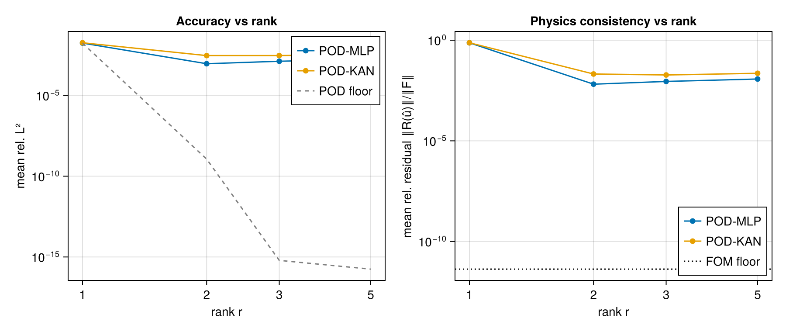
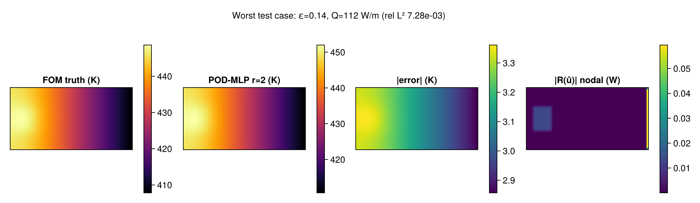

The parent's non-monotonicity lesson recurs *in extremis*: mode 3 is numerically dead
($\sigma_3/\sigma_1 \sim 10^{-8}$) and modes 4–5 are pure round-off, so ranks beyond 2 make
the network fit noise and measurably degrade both metrics. Model selection by validation
error, not by σ-decay alone, picks r = 2.

### 8.2 Timing: latency vs throughput

BenchmarkTools medians, batch size = 102. Speed-ups are batched throughput over FOM Newton
solves, including POD reconstruction (and unscaling for the direct model), excluding plotting
and model loading, after warm-up:

| method | single (ms) | batched (ms/q) | single× | batched× | allocs (1-q) |
| --- | ---: | ---: | ---: | ---: | ---: |
| FOM solve | 49.4 | — | 1× | — | 188,945 |
| direct MLP | 0.086 | 0.0074 | 576× | 6,711× | 22 |
| POD-MLP | 0.011 | 0.0050 | 4,468× | 9,923× | 31 |
| POD-KAN | 0.011 | 0.0045 | 4,541× | 10,899× | 90 |

The 10³–10⁴× factors are larger than the parent's because the FOM is now a nonlinear solve;
that is the honest framing: surrogate value grows with FOM cost. The headline of the method
remains the structure (rank-2 basis, physics metrics), not the raw speed-up.

### 8.3 Transient validation

Fixed-Δt convergence against a tight FBDF reference (smooth sinusoidal load): ImplicitEuler
rates 0.954/0.967/0.980, Trapezoid 2.077/2.017/2.004. The θ-family behaves exactly as
advertised through the nonlinear boundary term. Long-horizon constant-load runs reproduce the
steady solution to the integrator tolerance, and the square-wave cycle run shows the radiated
power lagging the load with the expected
$\tau_\text{rad} \approx \rho c (V/A) / 4\varepsilon\sigma T^3 \sim 10^4$ s relaxation, a
sensible regime against the 1.8–10.8 ks load periods.

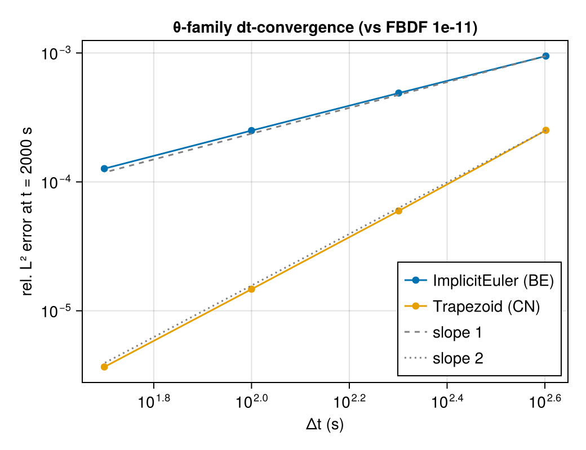
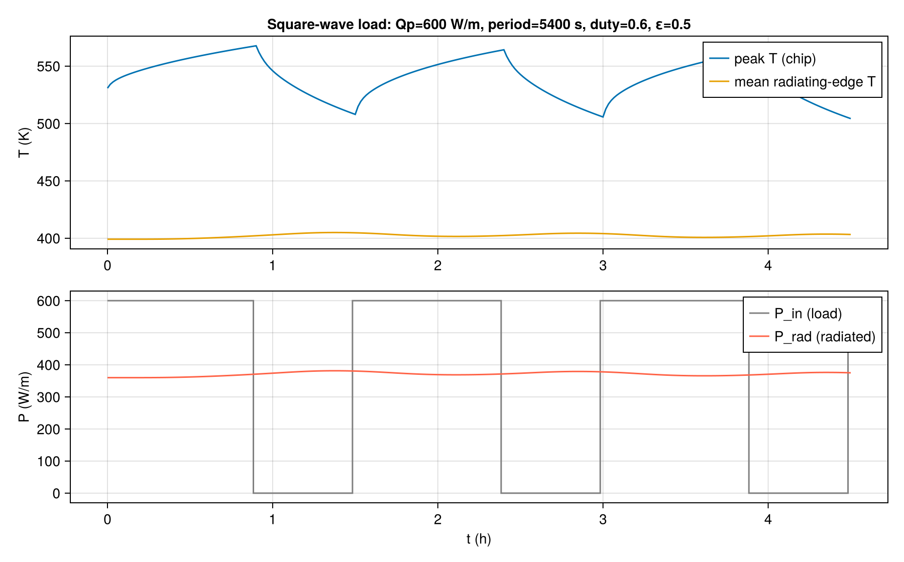

*The radiator's thermal inertia filters the 0↔600 W square wave down to a ~20 W ripple in
radiated power: the radiating edge effectively sees the orbit-average load while the chip
sawtooths over ~60 K.*

### 8.4 Space-time surrogate

96 Sobol trajectories over $\mu = (\varepsilon, Q_p, \text{duty}, \text{period})$, three
load periods each, 61 phase-uniform states, started from the steady state at the cycle-mean
load (median transient FOM solve 13 s, about 270× the steady solve; this is what makes a
transient surrogate worth having). The space-time POD delivers the promised contrast to §5:
instead of a rank-3 cliff, a smooth spectrum with
$\sigma_4/\sigma_1 = 6.4\cdot10^{-3}$, $\sigma_8/\sigma_1 = 3.0\cdot10^{-5}$,
$\sigma_{16}/\sigma_1 = 6.9\cdot10^{-8}$. **Switching transients re-thicken the manifold.**

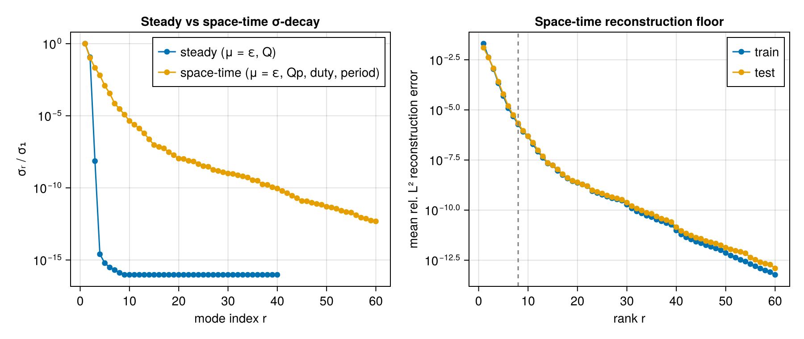

The $(\tilde\mu, t)$ mapper (inputs: 4 parameters, normalized time, two phase harmonics;
128×3 MLP) uses *capped* whitening: full whitening would upweight $\sigma_8$-level modes by
~3·10⁴ and the net burns its capacity on unlearnable switching detail, so the scales are
floored at 1% of $\sigma_1$.

| $r$ | traj rel L² | POD floor |
| ---: | ---: | ---: |
| 4 | 1.69e-2 | 2.5e-4 |
| **8** | 1.74e-2 | 2.1e-6 |
| 16 | 1.76e-2 | 1.1e-8 |
| 32 | 1.45e-2 | 1.2e-10 |

The sweep is *flat*: the mapper, not the basis, is the binding constraint. This is the steady
lesson in mirror image (there the basis was five orders better than needed; here it is four
to eight). Learning $c$ as an explicit function of $(\mu, t)$ across parameter-dependent
switching fronts is genuinely hard for a small regression; the principled fix is latent
*dynamics* (neural ODE / operator inference on $c(t)$, §11), not more modes.

QoI tracking at the deployed $r=8$: peak-temperature error median 14.3 K / max 42.6 K along
trajectories; radiated-power tracking error median 14% / max 39%. The worst case is
instructive: it is the *low-load* corner ($Q_p = 136$ W/m), where the true
$P_\text{rad} \approx 94$ W is nearly constant because the radiator's thermal inertia filters
the square wave almost completely, so a small absolute error is large relative to the local
signal. On design-relevant loads the same surrogate ranks designs almost perfectly (§8.6).

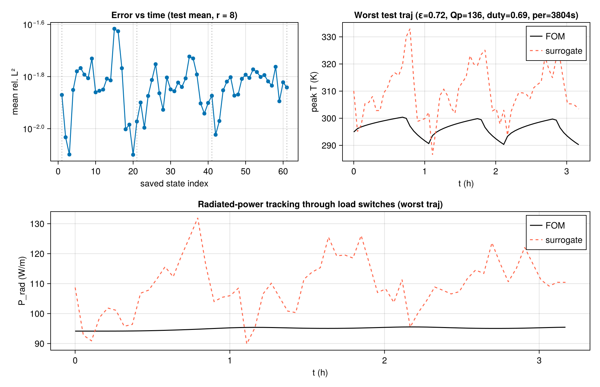

*Error vs time, peak-temperature trace, and radiated power vs time for a load cycle
(surrogate vs FOM), shown for the worst held-out trajectory.*

### 8.5 How many modes when radiation dominates?

The scope document asked how the mode count responds to the radiation regime. Conditioning
the snapshot sets on emissivity bins (Nr from the mean radiating-edge temperature per bin):

| ε bin | Nr (transient) | steady modes @1e-6 | space-time @1e-4 | @1e-6 |
| --- | ---: | ---: | ---: | ---: |
| [0.10, 0.38] | 0.21 | 2 | 6 | 12 |
| [0.38, 0.67] | 0.23 | 2 | 6 | 12 |
| [0.67, 0.95] | 0.27 | 2 | 7 | 12 |

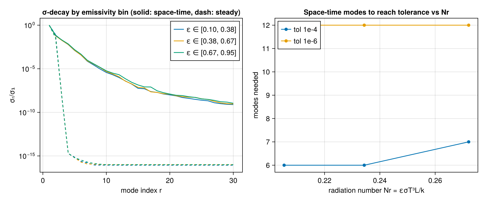

The honest answer: over this parameter box the mode count grows only weakly with Nr; the
dominant axis is **steady vs transient** (2 modes vs ~6–12), not the radiation regime. The
steady rank collapse is regime-independent, confirming it is a geometry property (fixed load
shape), not a radiation property.

### 8.6 Design study: ranking fidelity at throughput

The capstone reproduces the project's stated success criterion, a tool for testing subtle
design changes. Candidate designs: a 10×10 grid over emissivity coating ε ∈ [0.15, 0.9] and
load duty ∈ [0.25, 0.75] at fixed $Q_p = 650$ W/m, period 5400 s; QoI = worst-case chip
temperature over the final (settled) load cycle.

| | FOM | surrogate (r = 8) |
| --- | ---: | ---: |
| 100-candidate sweep | 996.6 s | **2.7 s** (373×, end-to-end) |
| QoI error | — | median 2.4 K, max 16.5 K (range 382–785 K) |
| Spearman rank correlation | — | **0.9987** |
| top-5 designs recovered | — | **5 / 5** |
| best design | (ε=0.90, duty=0.25) | **(ε=0.90, duty=0.25)**, identical |

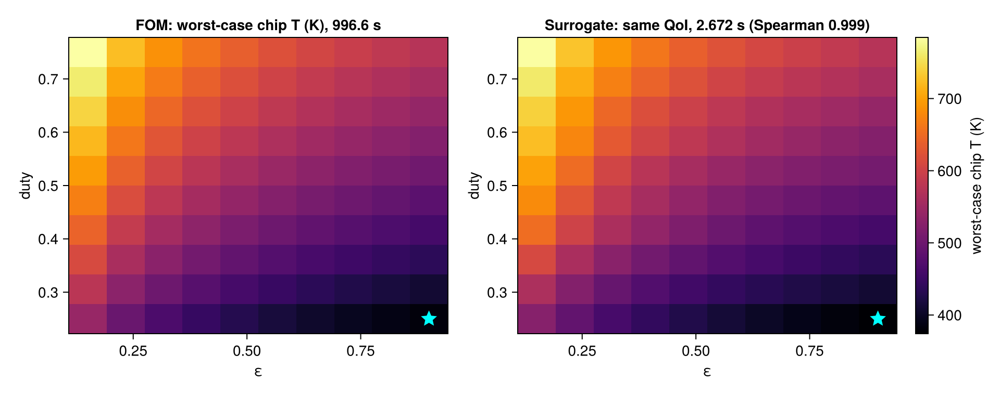

*Worst-case chip temperature over a 10×10 (ε, duty) grid. The surrogate reproduces the FOM
ranking with Spearman correlation 0.999 at 373× higher throughput, with the same best
design point (star).*

The claim defended is deliberately *ranking fidelity*, not pointwise truth: a screening tool
must order candidates correctly and hand the shortlist to the full-order model, which this
one does, in-distribution, with margin.

## 9. Interactive console

`scripts/14_run_console.jl` (GLMakie) solves the steady FOM *live* while you drag
$(\varepsilon, Q)$; a 50 ms Newton solve is interactive. Next to it sit the surrogate's
prediction, the error field, QoI readouts, and both σ-spectra; the transient panel updates
the surrogate's peak-temperature trace instantly and overlays the true FOM trajectory on
demand. `CONSOLE_SMOKE=1` renders the same layout headlessly for CI. The console is the
microscope, not the science.

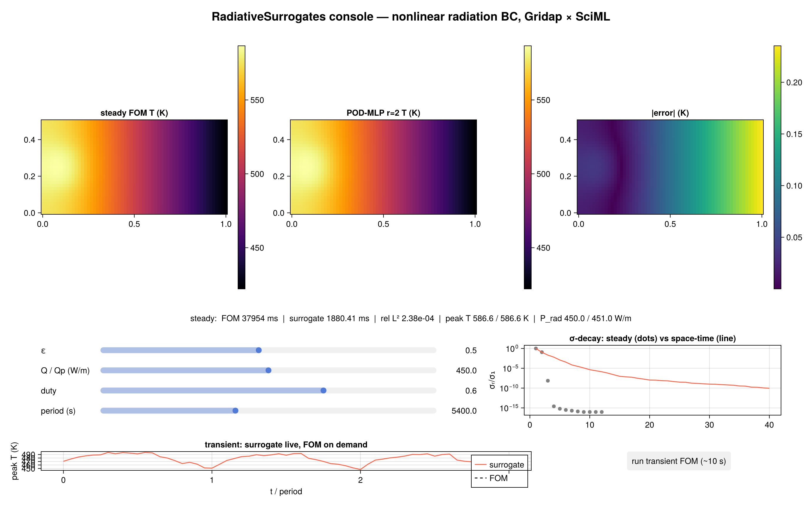

## 10. Discussion

**What this demonstrates.**
1. The right-basis thesis survives contact with a strongly nonlinear BC, and it sharpens:
   for fixed load geometry the steady manifold is rank-2/3 with *all* nonlinearity in
   $c(\mu)$, the best possible case for coefficient mappers and one that intrusive methods
   would still have to hyper-reduce their way through.
2. Physics metrics do the discriminating. L² errors of the direct and reduced surrogates
   differ by ~6×; their PDE residuals differ by ~6,000×. Reporting only L² would hide what
   matters.
3. The surrogate preserves design rankings (worst-case temperature) at over two orders of
   magnitude higher throughput end-to-end, making it a practical screening tool for radiator
   design studies; batched steady field queries reach 10³–10⁴×.

**Caveats.** 2D, fixed geometry, unity view factor (deep space only), constant properties,
effective (not measured) $\rho c$, in-distribution queries only, and a single PDE family:
a controlled prototype, not a general theorem. The steady rank-3 result is a property of the
fixed load geometry, not of radiation physics; parametric load *placement* would re-thicken
the steady manifold (future work).

## 11. Future work

Thin-plate fin variant (radiation as a volumetric $2\varepsilon\sigma(u^4 - T_s^4)/t$ sink;
same Newton machinery); parametric load geometry; view factors and orbital environment
(solar/albedo as boundary sources); latent dynamics for $c(t)$ via the SciML stack (neural
ODE / operator inference) instead of the $(\mu, t)$ regression; residual-informed training
through the assembled nonlinear residual; unstructured GridapGmsh geometries; 3D;
mass-matrix-weighted POD.

## References

- Gridap: Badia & Verdugo, *Gridap: An extensible FE toolbox in Julia*, JOSS 2020.
- NonlinearSolve.jl / OrdinaryDiffEq.jl: Pal et al. 2024; Rackauckas & Nie 2017.
- Reduced-basis methods: Quarteroni, Manzoni & Negri, *Reduced Basis Methods for PDEs*, 2016.
- DEIM: Chaturantabut & Sorensen, SIAM J. Sci. Comput. 2010.
- Kolmogorov–Arnold networks: Liu et al., 2024; `KolmogorovArnold.jl`.
- Parent project: `../report/report.md`, *Learning PDE Solution Operators in the Right Basis*.
