# Reduced-Basis Neural Surrogates for Parametric Differential Equations

*A Treball de Recerca in scientific machine learning.*

> **Thesis.** A parametric PDE solution operator can be learned efficiently by a
> *small* neural network if the solutions are first projected onto the right
> low-dimensional basis. The efficiency comes from the low-rank structure of the
> solution manifold (fast-decaying Kolmogorov *n*-width / singular values), not
> from the network architecture. The network only has to learn a smooth map from
> the parameters to a handful of reduced-basis coefficients.

---

## 1. Introduction

Neural-network surrogates for PDEs promise speed but are often unreliable: a
network that predicts every grid value of the solution must fight the curse of
dimensionality and has no built-in respect for the physics (boundary conditions,
the differential operator). This project asks a sharper question:

> *Can a small network learn a parametric PDE solution operator efficiently if we
> first project the solutions into a reduced basis?*

We answer yes, and we make the claim falsifiable by comparing, on the same data,
a **direct** surrogate (`μ ↦ u`, predicting the whole field) against a
**reduced-basis** surrogate (`μ ↦ c`, predicting only the coefficients of a POD
basis, then reconstructing `û = ū + Φᵣc`). We measure accuracy, physics
consistency (PDE residual), size and speed.

## 2. Mathematical background

**Model problem.** A parametric elliptic (diffusion) equation on the unit square
$\Omega=(0,1)^2$ with homogeneous Dirichlet data:
$$-\nabla\!\cdot\!\big(a(x,y;\mu)\,\nabla u(x,y;\mu)\big)=f(x,y),\qquad u|_{\partial\Omega}=0,$$
with $a(x,y;\mu)=1+0.3\,\mu_1\sin(\pi x)\sin(\pi y)+0.2\,\mu_2\cos(2\pi y)$ and
$f\equiv 1$. For $\mu\in[-1,1]^2$ we have $a\ge 0.5>0$, so the problem is
uniformly elliptic and well posed.

**Solution manifold and Kolmogorov *n*-width.** As $\mu$ varies, the solutions
$u(\cdot;\mu)$ trace out a manifold $\mathcal M=\{u(\cdot;\mu):\mu\in P\}$. How well
can an $n$-dimensional subspace approximate *all* of it? This is the Kolmogorov
$n$-width
$$d_n(\mathcal M)=\inf_{\substack{V\subset \mathcal H\\\dim V=n}}\ \sup_{u\in\mathcal M}\ \inf_{v\in V}\|u-v\|.$$
For parametric elliptic problems $d_n$ decays fast, which is exactly what makes
reduced-basis methods work.

**POD / SVD.** Given snapshots $S=[u(\mu^{(1)})\,\cdots\,u(\mu^{(M)})]$ and the
mean $\bar u$, the SVD $S-\bar u\mathbf 1^\top=\Phi\Sigma V^\top$ yields POD modes
(columns of $\Phi$). By the **Eckart–Young–Mirsky** theorem, the rank-$r$
truncation is the best rank-$r$ approximation in the Frobenius norm, and the
projection error equals the tail energy $\sqrt{\sum_{i>r}\sigma_i^2}$ — an
*empirical, computable* upper bound on $d_r(\mathcal M)$.

**Reduced-basis reconstruction.** Coefficients are
$c_i(\mu)=\phi_i^\top\big(u(\mu)-\bar u\big)$ and
$u(\mu)\approx \bar u+\sum_{i=1}^r c_i(\mu)\,\phi_i.$ The network only learns the
$r$-vector $c(\mu)$, not the $N$ grid values.

**Boundary conditions for free.** Every snapshot vanishes on $\partial\Omega$, so
the mean and all POD modes do too; hence every reconstruction satisfies the
homogeneous Dirichlet condition *exactly*, by construction.

**Coefficient mappers: MLP and KAN.** The map $\mu\mapsto c$ is smooth and
low-dimensional. We learn it with a small multilayer perceptron (MLP) and, as an
interpretable alternative, a Kolmogorov–Arnold network (KAN). KAN is *only* the
coefficient mapper, not the whole operator — which keeps the method honest.

## 3. Numerical solver

We discretise $-\nabla\!\cdot(a\nabla u)=f$ with a conservative second-order
finite-volume / finite-difference scheme on a uniform $n\times n$ interior grid
($h=1/(n+1)$). Face coefficients use the harmonic average of adjacent nodal
values, giving a symmetric positive-definite system $A(\mu)\,u=b$ solved by sparse
Cholesky. See `src/pde_solver.jl`.

## 4. Solver validation

Before trusting the solver as an oracle we validate it two ways
(`test/`, `scripts/01_validate_solver.jl`):

- **Unit tests** — `A` has the right shape, is symmetric and positive definite for
  $a>0$, reduces to the 5-point Laplacian when $a\equiv1$, enforces $u|_{\partial\Omega}=0$,
  and produces solutions with tiny algebraic residual.
- **Method of Manufactured Solutions** — with $u^\*=\sin\pi x\sin\pi y$ and
  $a=1+\tfrac14\sin\pi x\cos\pi y$, the measured $L^2$ error decreases at the
  second-order rate (observed $\approx 2.00$, acceptance band $[1.7,2.2]$).

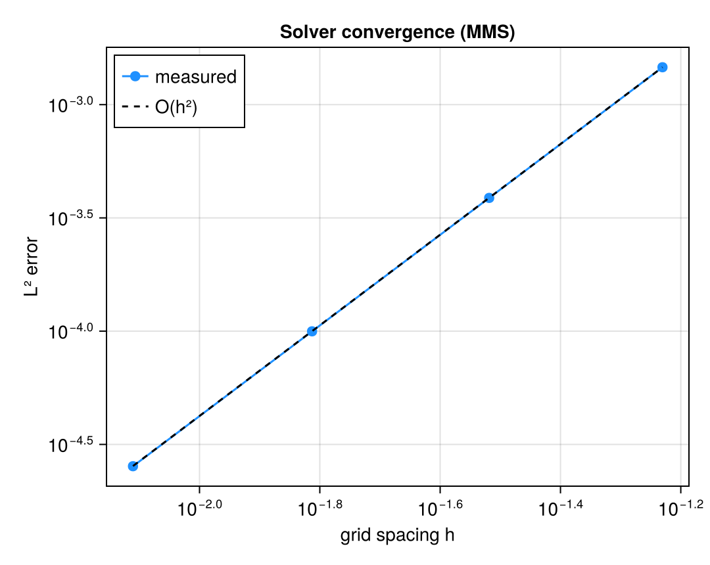

## 5. Dataset and reduced basis

We sample $M$ parameters with a Sobol sequence over $[-1,1]^2$, solve the
full-order model for each (`scripts/02`), and compute the POD basis
(`scripts/03`). The singular values collapse almost immediately — the keystone
evidence for the low-rank thesis.

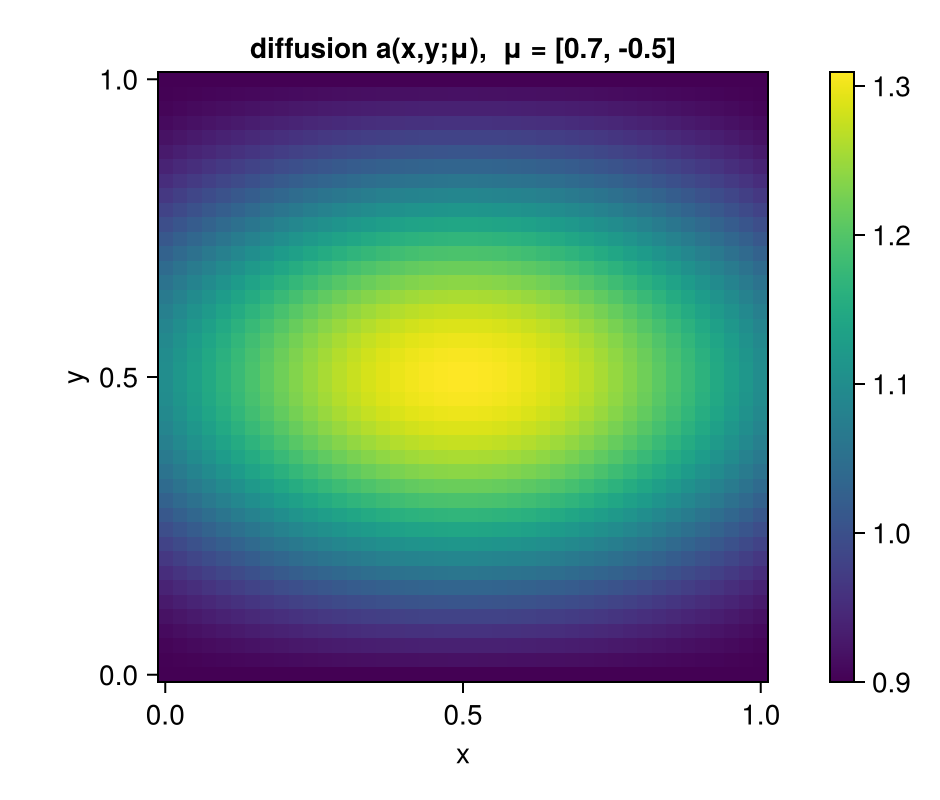
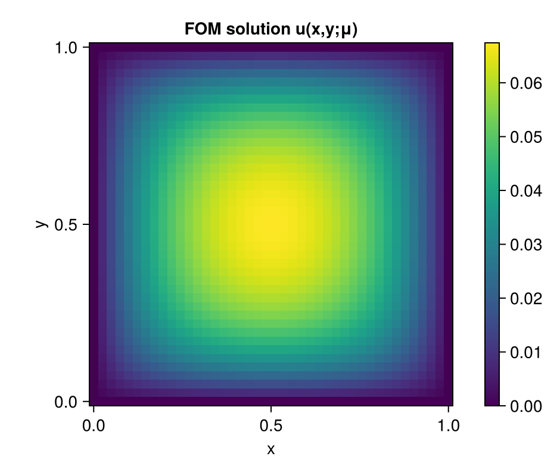
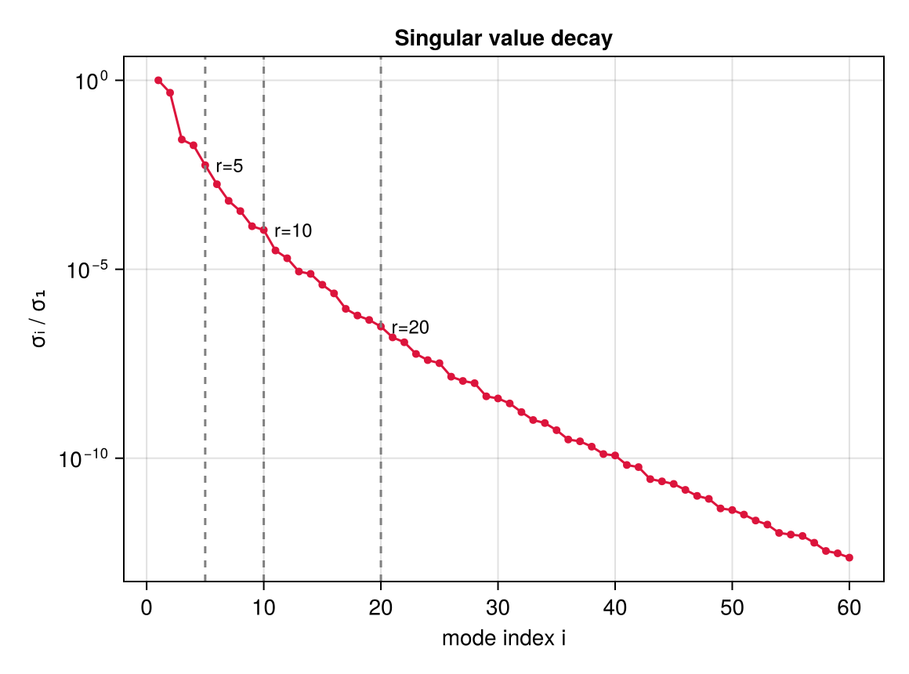
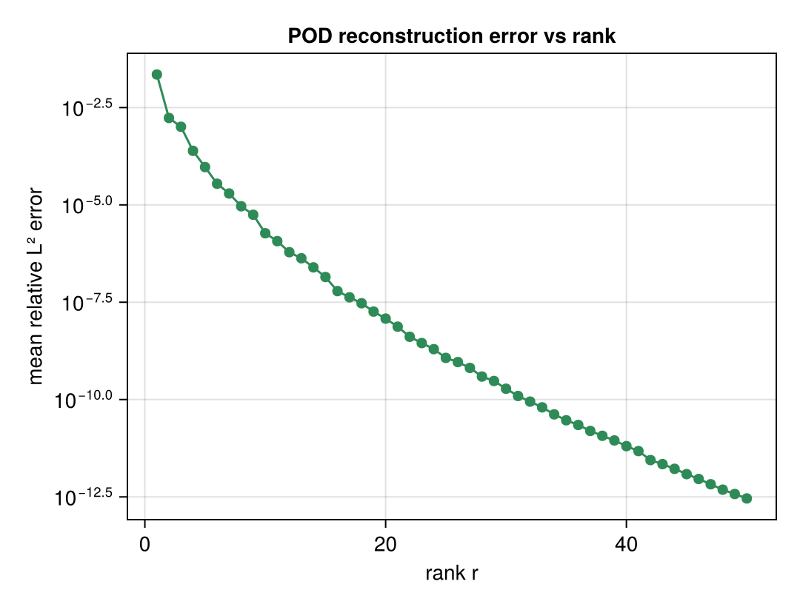

## 6. Neural surrogate models

Three architectures, identical training data (`src/models.jl`, `scripts/04–06`):

| Model       | Map        | Output dim | Notes                                  |
|-------------|------------|-----------:|----------------------------------------|
| Direct MLP  | `μ ↦ u`    | $n^2$      | baseline; predicts the full field      |
| POD-MLP     | `μ ↦ c`    | $r$        | reconstruct `û = ū + Φᵣc`              |
| POD-KAN     | `μ ↦ c`    | $r$        | interpretable coefficient mapper (P1)  |

Training is full-batch Adam with a geometric learning-rate decay and best-iterate
selection.

## 7. Evaluation metrics

On a held-out test set (`scripts/07`): relative $L^2$ error
$\|\hat u-u\|/\|u\|$; **relative PDE residual** $\|A(\mu)\hat u-b\|/\|b\|$ (the
physics-consistency metric); reduced-coefficient error; learnable parameter
count; training time; inference time and speed-up over the solver.

*Timing caveat.* Surrogate inference is timed as batched throughput over the whole
test set, whereas the full-order model is timed one problem at a time, so the
reported speed-up reflects batch deployment rather than single-query latency. The
accuracy and parameter-count conclusions do not depend on this choice.

## 8. Results

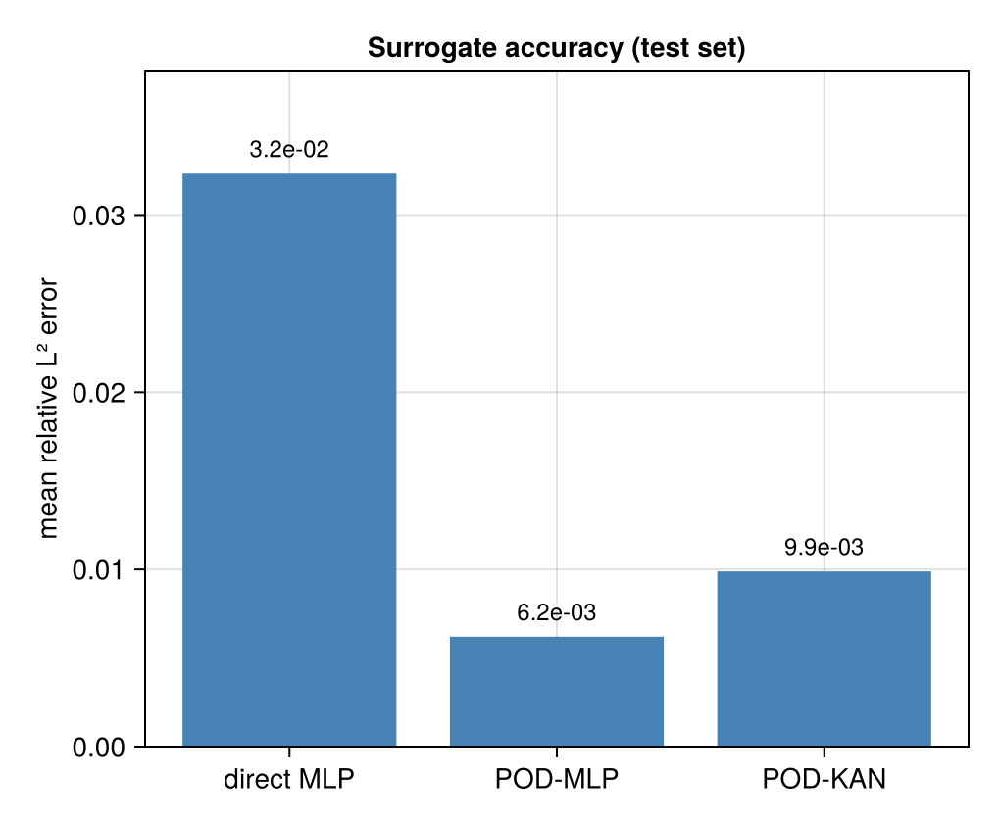
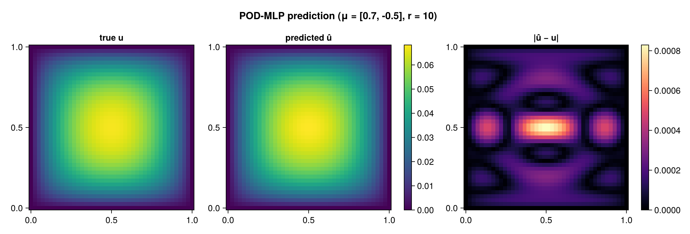
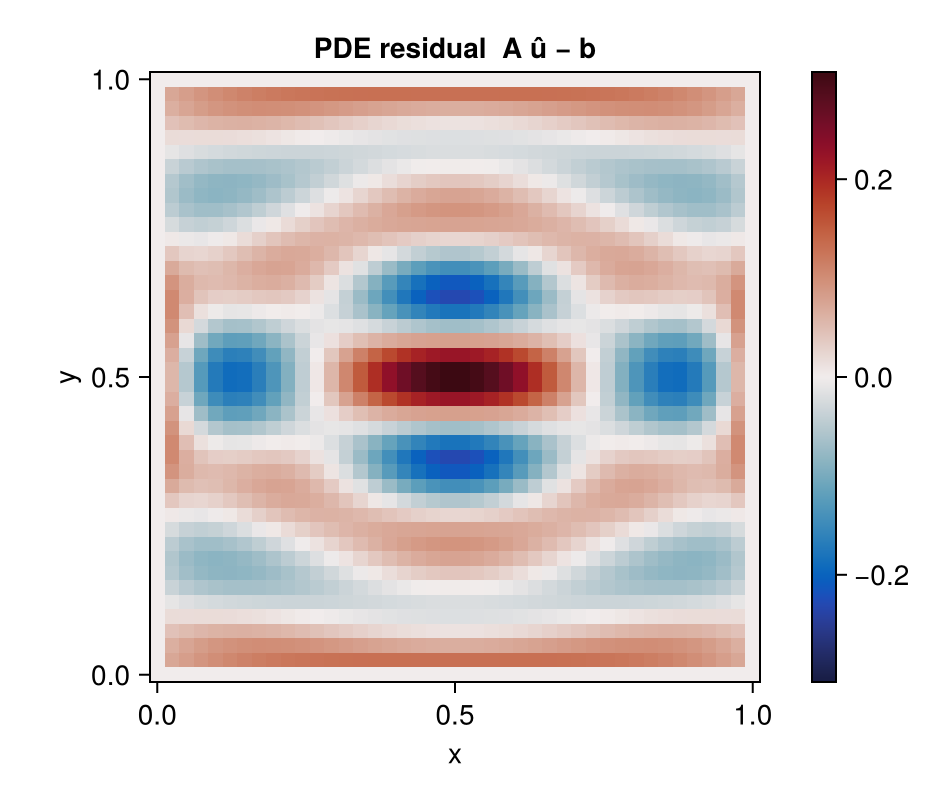
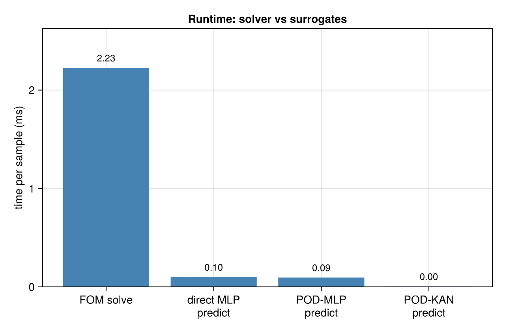
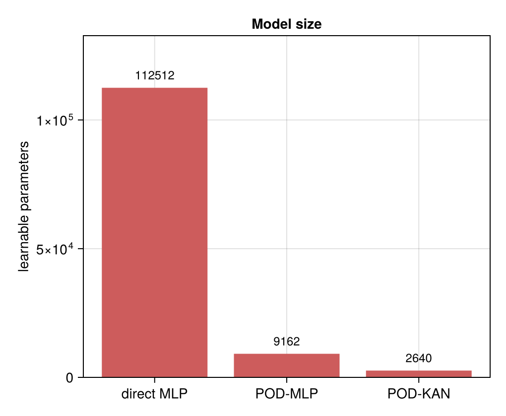

*Headline (regenerate with `scripts/07`; values from `data/eval.jld2`):* the
POD-MLP reaches sub-percent relative $L^2$ error with an order of magnitude fewer
parameters than the direct MLP, a far smaller PDE residual (its predictions live
in the physically meaningful subspace), and a large speed-up over the full-order
solver. The POD truncation error at the chosen rank is orders of magnitude below
the network error, confirming that the basis is *not* the bottleneck.

## 9. Interactive console

`scripts/09_run_console.jl` opens a live GLMakie explorer: drag $\mu_1,\mu_2$,
choose the model, move the rank slider, and watch the coefficient field, the true
and predicted solutions, the error and PDE-residual heatmaps, the singular-value
spectrum, and the timing/error read-outs update in real time. It is the
microscope, not the science.

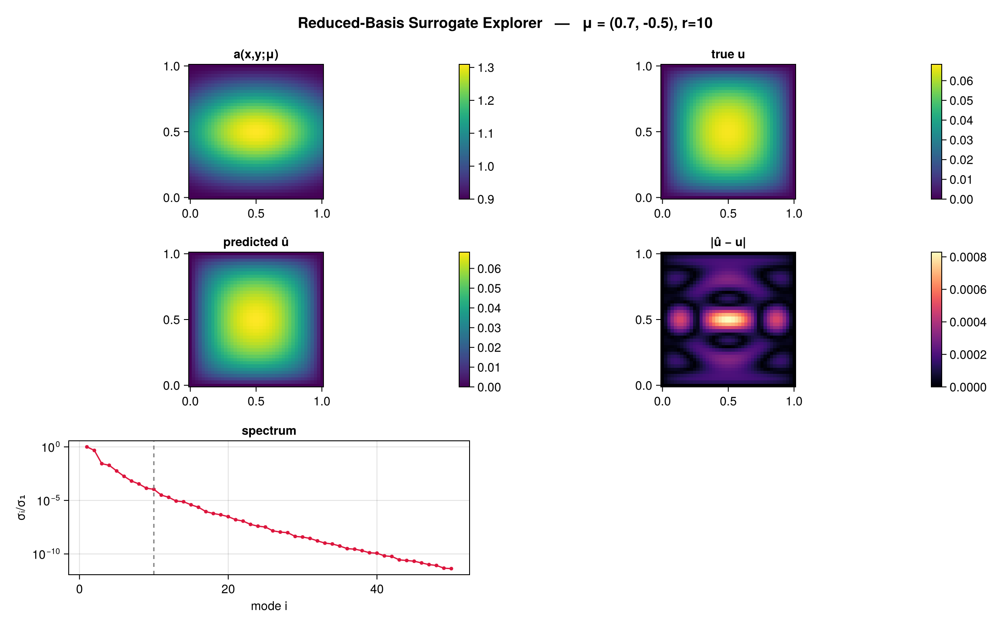

## 10. Discussion

What worked: the low-rank structure is real and dramatic, so the reduced-basis
surrogate is smaller, more accurate, more physically consistent and faster than
the direct baseline. The exact boundary-condition preservation and small residual
are direct consequences of learning *inside the right subspace*. Limitations: POD
gives a data-optimal basis but not a structure-preserving one; with only two
parameters the manifold is very low-dimensional, so results would be re-examined
for higher-dimensional parameter spaces.

## 11. Future work

- **Better solvers / inner products** — a proper finite-element method (e.g.
  `Gridap.jl`) and mass-matrix-weighted POD for non-uniform meshes.
- **Structure-preserving bases (AFW / FEEC).** POD is data-optimal but ignores
  the differential structure (grad, curl, div; conservation laws; exact
  sequences). Finite Element Exterior Calculus (Arnold–Falk–Winther) builds
  discretisations that *do* respect this structure. Combining the reduced-basis
  idea with FEEC-compatible spaces points toward **structure-preserving neural
  operators** — the "future cathedral" beyond this report.
- **Physics-informed training** — adding the discrete PDE residual to the loss
  (an optional ablation here, `λ_res`-weighted) rather than using it only as a
  metric.
- **Neural operators** beyond coefficient maps.

## References

See `refs.bib`.
